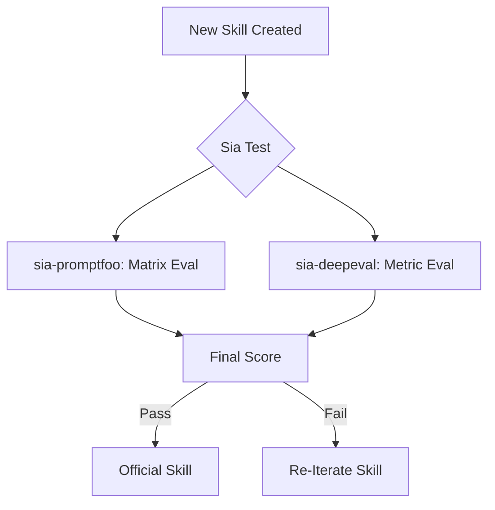

# Sia Testing Strategy: Agentic Skill Validation

To ensure **Agentic Skills** are reliable and follow architectural principles, Sia utilizes a multi-layered testing approach.

## 1. Multi-Framework Evaluation
We implement two distinct industry-standard frameworks to provide holistic validation:

### [Promptfoo](../packages/sia-promptfoo/) (Local & Deterministic)
- **Role**: Fast, local, and developer-friendly evaluations.
- **Focus**: Comparing "Before" and "After" references to ensure the delta matches the protocol.
- **Metrics**: JavaScript-based custom assertions and model-graded comparisons.

### [DeepEval](../packages/sia-deepeval/) (Research & Metric-Heavy)
- **Role**: Rigorous, research-backed generation quality assessment.
- **Focus**: Faithfulness, Answer Relevancy, and Hallucination detection in the refactored code.
- **Metrics**: Python-based G-Eval and proprietary metric suites.

## 2. The Verification Workflow

## 3. Data-Driven Guardrails
Each skill must provide a `references/` directory with `before` and `after` code samples. The testing frameworks use these as ground truth to:
1. Verify the **Trigger** (Does it fire when it should?).
2. Verify the **Protocol** (Is the transformation correct?).
3. Verify the **Output** (Is the result clean and functional?).
